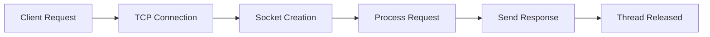

<div class="message">


In today's digital landscape, real-time communication has become essential for modern web applications. From chat applications to multiplayer games, the demand for instantaneous data exchange has never been higher. This comprehensive guide takes you on a journey from the fundamentals of HTTP to implementing scalable WebSocket applications.

We'll start by understanding HTTP's evolution and its limitations, explore web servers' inner workings, and then dive deep into WebSocket technology. Through practical examples and real-world scenarios, we'll build a foundation for implementing real-time features in your applications. Finally, we'll put theory into practice by designing a multiplayer game using WebSockets, demonstrating different architectural approaches and their trade-offs.

This guide is structured to provide both theoretical knowledge and hands-on experience, making it valuable for developers at all levels who want to master real-time web communication.

 <h1>What You'll Learn</h1>
<ul>
<li>HTTP fundamentals and evolution</li>
<li>Web server architecture and implementation</li>
<li>WebSocket protocol and its advantages</li>
<li>Scaling WebSocket applications</li>
<li>Real-time game design patterns</li>
<li>Security considerations and best practices</li>
</ul>
</div>

# Understanding HTTP: From Basics to HTTP/3

## Introduction
HTTP (Hypertext Transfer Protocol) is the foundation of data communication on the internet. Let's explore its evolution and core concepts.

## Basic Architecture

### Client-Server Model
- **Client**: Browser, Python/JavaScript apps, or any HTTP request-making application
- **Server**: Web servers like IIS, Apache Tomcat, Node.js, Python Tornado

## HTTP Request Components

1. **URL (Uniform Resource Locator)**
   - Identifies server location
   - Specifies resource path

2. **Method Type**
   - GET: Retrieve data
   - POST: Submit data
   - PUT: Update data
   - DELETE: Remove data

3. **Headers**
   - Authentication tokens
   - Cookies
   - Host information
   - Content types

4. **Body**
   - Actual data payload
   - Optional (not used in GET requests)

## HTTP Response Components

1. **Status Codes**
   - 200: Success
   - 201: Created
   - 400: Bad Request
   - 403: Forbidden
   - 404: Not Found
   - 500: Server Error

2. **Headers**
   - Content type
   - Metadata
   - Server information

3. **Body**
   - Requested data
   - Response content

## Evolution of HTTP

### HTTP/1.0 (1996)
- New TCP connection per request
- Connection closes after each request
- Inefficient for modern web applications
- High latency due to TCP handshakes

### HTTP/1.1
- Persistent TCP connections (keep-alive)
- Reduced latency
- Streaming with chunked transfer
- Pipelining (disabled by default)
- Better resource utilization

### HTTP/2
- **Key Improvements**:
  - Header compression
  - Multiplexing (multiple requests over single TCP)
  - Server push capability
  - SPDY protocol support
  - Default HTTPS
  - Protocol negotiation (NPN/ALPN)

### HTTP/3 (HTTP/2 over QUIC)
- **Features**:
  - Uses QUIC instead of TCP
  - Built on UDP with congestion control
  - Retains HTTP/2 features
  - Improved performance
  - Better handling of connection losses
  - Experimental status

## HTTPS Working
1. Initiates TCP connection
2. Performs TLS handshake
3. Exchanges encrypted data
4. Maintains secure communication
5. Terminates connection with acknowledgment

## OSI Layer
HTTP operates at Layer 7 (Application Layer) of the OSI model, handling data formatting and transfer protocols.

This evolution shows how HTTP has adapted to meet increasing demands for faster, more secure, and more efficient web communication.


Here's a refined version of the Web Servers explanation in Markdown format:

# Understanding Web Servers

## What is a Web Server?

A web server is a software system that:
- Serves web content (HTML, CSS, JS, JSON, etc.)
- Implements HTTP protocol
- Handles both static and dynamic content
- Hosts websites, web applications, and APIs

## Types of Content

### Static Content
- Same content for all users
- Files stored on server
- No processing required
- Example: Company "About" page

### Dynamic Content
- Content varies based on user/request
- Generated on-the-fly
- Requires processing
- Example: Social media feed

## Web Server Architecture

### Basic Operation
- Listens on standard ports:
  - Port 80 (HTTP)
  - Port 443 (HTTPS)
- Handles network requests
- Manages TCP connections

### Blocking Single-Threaded Server Model



#### Characteristics:
- One request processed at a time
- Blocks during I/O operations
- Maintains TCP socket in memory
- Limited concurrent handling

### Modern Server Implementations

1. **Multi-threaded Servers (e.g., Apache, Tomcat)**
   - Spawns new thread per request
   - Configurable thread limit
   - Better concurrency

2. **Event-driven Servers (e.g., Node.js)**
   - Single-threaded with event loop
   - Non-blocking I/O
   - Request queue management
   - Efficient resource usage

## Popular Web Servers

### Off-the-Shelf Solutions
- Apache HTTP Server
- Nginx
- IIS (Internet Information Services)
- Lighttpd
- Tomcat

### Custom Implementation Platforms
- Node.js
- Python Tornado
- Express.js

## Example: Setting Up Apache Server

```bash
# Install Apache
sudo apt-get update
sudo apt-get install apache2

# Start service
sudo systemctl start apache2

# Check status
sudo systemctl status apache2
```

## Example: Simple Express.js Server

```javascript
const express = require("express");
const app = express();
const path = require("path");

app.get("/", (req, res) => {
  res.sendFile(path.join(__dirname, "index.html"));
});

app.listen(8080, () => console.log("Server running on port 8080"));
```

## Best Practices

1. **Security**
   - Keep software updated
   - Use HTTPS
   - Implement proper authentication
   - Configure firewalls

2. **Performance**
   - Enable caching
   - Compress responses
   - Optimize static content
   - Monitor resource usage

3. **Scalability**
   - Use load balancers
   - Implement containerization
   - Configure auto-scaling
   - Monitor metrics

This overview covers the fundamentals of web servers, their implementation, and basic setup examples. Understanding these concepts is crucial for web development and system administration.


# WebSockets: A Comprehensive Guide

## Introduction
WebSocket is a bidirectional, full-duplex communication protocol built on top of HTTP/1.1, enabling real-time data exchange between clients and servers.

## Core Concepts

### Protocol Overview
- Built on HTTP/1.1
- Maintains persistent connections
- Stateful protocol
- Supports bidirectional communication
- Uses ws:// or wss:// (secure) protocol

### Connection Flow
```text
Client                                             Server
  |                                                 |
  |           HTTP Upgrade Request                  |
  |------------------------------------------------>
  |                                                 |
  |         101 Switching Protocols                 |
  |<------------------------------------------------
  |                                                 |
  |        === WebSocket Connection Established === |
  |                                                 |
  |               Message 1                         |
  |------------------------------------------------>
  |                                                 |
  |               Message 2                         |
  |<------------------------------------------------
  |                                                 |
  |               Message 3                         |
  |------------------------------------------------>
  |                                                 |
  |               Message 4                         |
  |<------------------------------------------------
  |                                                 |
  |          Connection Close                       |
  |------------------------------------------------>
  |                                                 |

```

### WebSocket Handshake Example
```http
# Client Request
GET /chat HTTP/1.1
Host: server.example.com
Upgrade: websocket
Connection: Upgrade
Sec-WebSocket-Key: xJJJHMbDL1EzLkh9GBhXDw==
Sec-WebSocket-Protocol: chat, superchat
Sec-WebSocket-Version: 13
Origin: http://example.com

# Server Response
HTTP/1.1 101 Switching Protocols
Upgrade: websocket
Connection: Upgrade
Sec-WebSocket-Accept: HSMrcOsM1YUkAGmm5OPpG2HaGWk=
Sec-WebSocket-Protocol: chat
```

## Common Use Cases
1. Real-time Chat Applications
2. Live Data Feeds
3. Multiplayer Gaming
4. Progress Monitoring
5. Real-time Analytics
6. Collaborative Tools

## Implementation Example

### Server Implementation
```javascript
const http = require("http");
const WebSocketServer = require("websocket").server;
let connection = null;

// Create HTTP server
const httpserver = http.createServer((req, res) => {
  console.log("Request received");
});

// Initialize WebSocket server
const websocket = new WebSocketServer({
  httpServer: httpserver
});

// Handle connections
websocket.on("request", request => {
  connection = request.accept(null, request.origin);
  
  connection.on("open", () => console.log("Connection opened"));
  connection.on("close", () => console.log("Connection closed"));
  connection.on("message", message => {
    console.log(`Received message: ${message.utf8Data}`);
  });
});

httpserver.listen(8080, () => console.log("Server listening on port 8080"));
```

### Client Implementation
```javascript
// Browser client code
const ws = new WebSocket("ws://localhost:8080");

ws.onmessage = message => {
  console.log(`Received: ${message.data}`);
};

// Send periodic messages
function sendPeriodic() {
  ws.send(`Message ${Math.random()}`);
  setTimeout(sendPeriodic, 5000);
}
```

## Project Setup
```bash
# Initialize project
npm init -y

# Install dependencies
npm i websocket
```

## Advantages and Limitations

### Advantages
- Full-duplex communication
- Real-time data transfer
- HTTP compatible
- Firewall friendly
- Standard protocol support

### Limitations
- Complex proxy handling
- Load balancing challenges
- Scaling difficulties
- Connection state management
- Resource intensive

## Alternatives

### When to Consider Alternatives
1. **Long Polling**
   - For less frequent updates
   - Simpler implementation
   - Better browser support

2. **Server-Sent Events**
   - One-way server-to-client communication
   - Simpler than WebSockets
   - Native browser support

### Decision Criteria
- Need for bidirectional communication
- Real-time requirements
- Scale requirements
- Browser support needs
- Infrastructure constraints

## Best Practices
1. Implement heartbeat mechanisms
2. Handle reconnection gracefully
3. Use secure WebSocket (wss://)
4. Implement proper error handling
5. Monitor connection health
6. Consider message queuing for reliability

## Conclusion
WebSockets provide powerful real-time communication capabilities but should be used judiciously based on specific application needs and infrastructure considerations. Consider alternatives for simpler use cases where full-duplex communication isn't essential.


# Scaling WebSockets Architecture

## Overview
Understanding how to scale stateful WebSocket connections using reverse proxies and pub/sub patterns.

## Architecture Diagram
```
                                 ┌─────────────┐
                                 │  WebSocket  │
                          ┌─────►│  Server 1   │
                          │      └─────────────┘
┌──────────┐      ┌──────┴────┐ ┌─────────────┐     ┌─────────────┐
│  Client  │──────►   Load    │ │  WebSocket  │     │    Redis    │
│ Devices  │──────►  Balancer │─►│  Server 2   │────►│   Pub/Sub   │
└──────────┘      └──────┬────┘ └─────────────┘     └─────────────┘
                          │      ┌─────────────┐
                          └─────►│  WebSocket  │
                                │  Server 3    │
                                └─────────────┘
```

## Components

### 1. Load Balancer
- Receives initial WebSocket connection requests
- Performs HTTP upgrade for WebSocket connections
- Routes connections to appropriate WebSocket servers
- Maintains persistent connections

### 2. WebSocket Servers
- Handle client connections
- Process messages
- Publish messages to Redis
- Subscribe to relevant topics
- Broadcast messages to connected clients

### 3. Redis Pub/Sub
- Central message broker
- Handles message distribution
- Enables cross-server communication
- Maintains message consistency

## Message Flow

1. **Client Connection**
   ```
   Client → Load Balancer → WebSocket Server
   ```

2. **Message Publication**
   ```
   Client → WebSocket Server → Redis Pub/Sub
   ```

3. **Message Distribution**
   ```
   Redis Pub/Sub → All WebSocket Servers → Connected Clients
   ```

## Implementation Example

### Load Balancer Configuration (HAProxy)
```conf
frontend websocket
    bind *:80
    mode http
    option http-server-close
    option forwardfor
    timeout client 30s
    default_backend ws_servers

backend ws_servers
    mode http
    balance roundrobin
    option forwardfor
    option http-server-close
    server ws1 ws1:8080 check
    server ws2 ws2:8080 check
    server ws3 ws3:8080 check
```

### WebSocket Server
```javascript
const WebSocket = require('ws');
const Redis = require('redis');

// Redis setup
const publisher = Redis.createClient();
const subscriber = Redis.createClient();

// WebSocket server
const wss = new WebSocket.Server({ port: 8080 });

// Handle connections
wss.on('connection', (ws) => {
    // Handle incoming messages
    ws.on('message', (message) => {
        // Publish to Redis
        publisher.publish('broadcast', message);
    });
});

// Subscribe to Redis channel
subscriber.subscribe('broadcast');
subscriber.on('message', (channel, message) => {
    // Broadcast to all connected clients
    wss.clients.forEach(client => {
        if (client.readyState === WebSocket.OPEN) {
            client.send(message);
        }
    });
});
```

## Advantages
1. Horizontal scalability
2. High availability
3. Load distribution
4. Message consistency
5. Fault tolerance

## Considerations
1. Session persistence
2. Connection handling
3. Message ordering
4. Failover strategies
5. Monitoring and logging

This architecture provides a robust foundation for scaling WebSocket applications while maintaining real-time communication capabilities across multiple servers.


# Implementing Scalable WebSockets with Docker

## Project Structure

### Docker Compose Configuration
```yaml
version: '3'
services:
  lb:
    image: haproxy
    ports:
      - "8080:8080"
    volumes:
      - ./haproxy:/usr/local/etc/haproxy
  ws1:
    image: wsapp
    environment:
      - APPID=1111
  ws2:
    image: wsapp
    environment:
      - APPID=2222
  ws3:
    image: wsapp
    environment:
      - APPID=3333
  ws4:
    image: wsapp
    environment:
      - APPID=4444
  rds:
    image: redis
```

### HAProxy Configuration
```conf
frontend http
    bind *:8080
    mode http
    timeout client 1000s
    use_backend all

backend all
    mode http
    timeout server 1000s
    timeout connect 1000s
    server s1 ws1:8080
    server s2 ws2:8080
    server s3 ws3:8080
    server s4 ws4:8080
```

### Dockerfile
```dockerfile
FROM node:13
WORKDIR /home/node/app
COPY app /home/node/app
RUN npm install
CMD npm run app
```

## Application Implementation

### WebSocket Server (Node.js)
```javascript
import http from "http";
import ws from "websocket";
import redis from "redis";

const APPID = process.env.APPID;
let connections = [];
const WebSocketServer = ws.server;

// Redis Configuration
const subscriber = redis.createClient({
    port: 6379,
    host: 'rds'
});

const publisher = redis.createClient({
    port: 6379,
    host: 'rds'
});

// Redis Event Handlers
subscriber.on("subscribe", (channel, count) => {
    console.log(`Server ${APPID} subscribed to livechat`);
    publisher.publish("livechat", "A message");
});

subscriber.on("message", (channel, message) => {
    try {
        console.log(`Server ${APPID} received message in channel ${channel}`);
        connections.forEach(c => c.send(APPID + ":" + message));
    } catch (error) {
        console.error("Error broadcasting message:", error);
    }
});

subscriber.subscribe("livechat");

// WebSocket Server Setup
const httpserver = http.createServer();
const websocket = new WebSocketServer({
    "httpServer": httpserver
});

httpserver.listen(8080, () => console.log("Server listening on port 8080"));

websocket.on("request", request => {
    const con = request.accept(null, request.origin);
    connections.push(con);

    con.on("open", () => console.log("Connection opened"));
    con.on("close", () => console.log("Connection closed"));
    con.on("message", message => {
        console.log(`${APPID} Received message ${message.utf8Data}`);
        publisher.publish("livechat", message.utf8Data);
    });

    setTimeout(() => con.send(`Connected to server ${APPID}`), 5000);
});
```

### Client Implementation
```javascript
const ws = new WebSocket("ws://localhost:8080");

ws.onmessage = message => console.log(message.data);
ws.onopen = () => ws.send("I am client!!!");
```

## Secure WebSocket Implementation (WSS)

### HAProxy SSL Configuration
```conf
frontend ws
    mode http
    timeout client 10s
    bind *:80
    bind *:443 ssl crt /Users/username/haproxy/mywebsocketsite.pem
    default_backend wsbackend

backend wsbackend
    mode http
    server s1 127.0.0.1:8080
    timeout connect 10s
    timeout server 100s
```

### Secure WebSocket Client
```javascript
const ws = new WebSocket("wss://127.0.0.1");
ws.onmessage = message => console.log(message);
```

## SSL Certificate Generation Guide

### 1. Chain of Trust
- Root CA (self-signed, trusted by browsers/OS)
- Intermediate CA(s) (signs end-entity certificates)
- Leaf certificate (your server certificate)

### 2. Generate CSR Configuration
```ini
[ req ]
prompt = no
distinguished_name = dn
req_extensions = req_ext

[ dn ]
C = US
ST = California
L = San Francisco
O = MyCompany
OU = Dev
CN = example.com

[ req_ext ]
subjectAltName = @alt_names

[ alt_names ]
DNS.1 = example.com
DNS.2 = www.example.com
DNS.3 = api.example.com
```

### 3. Certificate Generation Commands
```bash
# Generate private key
openssl genpkey \
  -algorithm RSA \
  -pkeyopt rsa_keygen_bits:2048 \
  -out server.key

# Generate CSR
openssl req \
  -new \
  -key server.key \
  -out server.csr \
  -config csr.cnf
```

### 4. Certificate Validation Methods
- HTTP-01: Token file in `.well-known/acme-challenge/`
- DNS-01: TXT record in `_acme-challenge.<domain>`
- TLS-ALPN-01: TLS listener on port 443

### 5. Deployment Steps
1. Install certificates
2. Configure web server
3. Set up monitoring
4. Implement auto-renewal
5. Regular security audits

## Build and Deploy
```bash
# Build WebSocket application
docker build -t wsapp .

# Start the stack
docker-compose up
```

This implementation provides a scalable, secure WebSocket infrastructure with load balancing and pub/sub capabilities.


# Multiplayer Game Design with WebSockets

## Game Overview
A real-time multiplayer game where players compete to capture cells in a 9x9 grid within 30 seconds.

## Game Board Representation
```
Player 1                Player 2
┌───┬───┬───┐          ┌───┬───┬───┐
│ 1 │ 2 │ 3 │          │ 1 │ 2 │ 3 │
├───┼───┼───┤          ├───┼───┼───┤
│ 4 │[5]│ 6 │          │ 4 │[5]│ 6 │
├───┼───┼───┤          ├───┼───┼───┤
│ 7 │ 8 │ 9 │          │ 7 │ 8 │ 9 │
└───┴───┴───┘          └───┴───┴───┘

Player 3                Player 4
┌───┬───┬───┐          ┌───┬───┬───┐
│ 1 │ 2 │ 3 │          │ 1 │ 2 │ 3 │
├───┼───┼───┤          ├───┼───┼───┤
│ 4 │[5]│ 6 │          │ 4 │[5]│ 6 │
├───┼───┼───┤          ├───┼───┼───┤
│ 7 │ 8 │ 9 │          │[7]│ 8 │ 9 │
└───┴───┴───┘          └───┴───┴───┘

[5] = Red (Captured)
[7] = Orange (Captured)
```

## Core Features
1. Game Creation
2. Player Join
3. Real-time Play
4. Score Broadcasting

## Design Approaches

### Design 1: Stateful Architecture
```
┌─────────┐    ┌────────────┐    ┌─────────────┐
│ Players │───►│   Load     │───►│  Game Server │
└─────────┘    │  Balancer  │    │  (Stateful) │
               └────────────┘    └─────────────┘
```

#### Components
- Single game server per match
- In-memory state management
- Direct WebSocket connections

#### Flow
1. **Create Game**
   ```javascript
   function createGame(gameId) {
     return hashToServer(gameId);
   }
   ```

2. **Join Game**
   ```javascript
   function joinGame(gameId, player) {
     const server = loadBalancer.getServer(gameId);
     return server.connect(player);
   }
   ```

3. **Game Play**
   ```javascript
   function playMove(gameId, player, cell) {
     gameState.update(player, cell);
     broadcast(gameState);
   }
   ```

### Design 2: Stateless Architecture
```
┌─────────┐    ┌────────────┐    ┌─────────────┐
│ Players │───►│   Load     │───►│ Any Game    │
└─────────┘    │  Balancer  │    │   Server    │
               └────────────┘    └─────┬───────┘
                                      │
                                ┌─────▼───────┐
                                │  Pub/Sub    │
                                │   System    │
                                └─────────────┘
```

#### Components
- Multiple game servers
- Centralized state storage
- Pub/Sub messaging system

#### Flow
1. **Create Game**
   ```javascript
   function createGame(gameId) {
     return initializeGameState(gameId);
   }
   ```

2. **Join Game**
   ```javascript
   function joinGame(gameId, player) {
     subscribeToGame(gameId);
     return connectToAnyServer(player);
   }
   ```

3. **Game Play**
   ```javascript
   function playMove(gameId, player, cell) {
     updateGameState(gameId, player, cell);
     publishUpdate(gameId, gameState);
   }
   ```

## Comparison

### Stateful Design
#### Pros
- Lower latency
- Simpler implementation
- Direct state management

#### Cons
- Limited scalability
- No game recovery
- Server-bound sessions

### Stateless Design
#### Pros
- Horizontal scalability
- Fault tolerance
- Game state persistence

#### Cons
- Higher latency
- Complex implementation
- Additional infrastructure

## Implementation Considerations

### State Management
```javascript
const gameState = {
    id: string,
    players: Map<playerId, {
        cells: number[],
        score: number
    }>,
    timeRemaining: number,
    status: 'waiting' | 'active' | 'completed'
};
```

### WebSocket Events
```javascript
ws.on('capture', (data) => {
    const { player, cell } = data;
    updateGameState(player, cell);
    broadcastState();
});
```

### Score Broadcasting
```javascript
function broadcastScore() {
    const scores = calculateScores();
    ws.clients.forEach(client => {
        client.send(JSON.stringify({ type: 'score', data: scores }));
    });
}
```

This architecture provides a foundation for building a scalable, real-time multiplayer game using WebSockets.


### Conclusion

Throughout this journey, we've evolved from understanding basic HTTP communications to implementing complex real-time applications using WebSockets. We've seen how WebSockets solve the limitations of traditional HTTP communication and enable truly interactive web experiences.

The progression from theory to practice has equipped us with:
- Deep understanding of web communication protocols
- Practical knowledge of WebSocket implementation
- Architectural patterns for scaling real-time applications
- Security considerations and best practices
- Hands-on experience with real-time game design

Whether you're building a chat application, a collaborative tool, or a multiplayer game, the principles and patterns we've covered provide a solid foundation for your real-time application development needs.

### Next Steps
- Experiment with different WebSocket libraries
- Implement the game design challenge
- Explore advanced scaling techniques
- Stay updated with WebSocket security best practices
- Consider contributing to open-source WebSocket projects

Remember, the real-time web is constantly evolving, and WebSockets are just one piece of the puzzle. Keep exploring, experimenting, and building to stay at the forefront of web development.

*Special thanks to Hussein Nasser for the original inspiration and technical insights that made this guide possible.*
